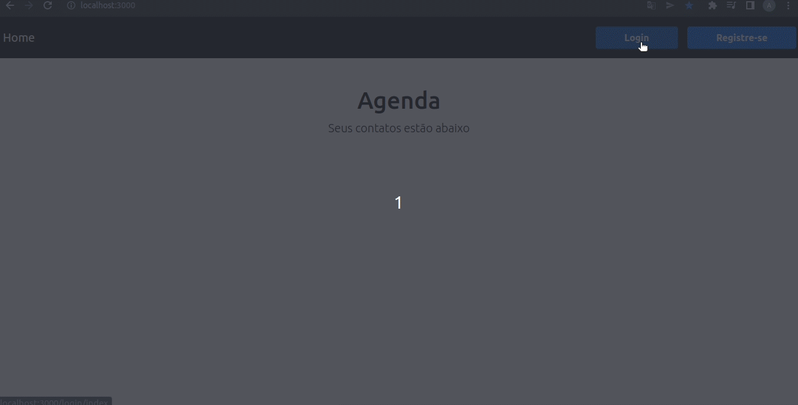

<h1>Agenda!</h1>
<h3>Projeto de Agenda criado no curso Javascript Básico ao Avançado do Prof. @luizomf, com CRUD básico usando o MongoDB.</h3>

<h2> A mesma Agenda, mas um pouco melhor.</h2>

    

 <h4> 👨‍💻 Durante o desenvolvimento do projeto, junto com as explicações do professor, alguns questionamentos foram levantados, que também trouxeram novos desafios e aprendizados.</h4>

✅ As melhorias feitas até então foram: 

- Autenticação de usuário com passport.js
- Relação com banco de dados
- Maior proteção de rotas
- Mais segurança nos dados cadastrados

<h2> Tecnologias utilizadas. </h2>

O projeto foi desenvolvido em Javascript, utilizando o NodeJS para back-end, EJS e Bootstrap para visualização dos dados.

<h2> Instruções </h2>

<h4> Após clonar o projeto na sua maquina instale todos os pacotes: </h4>
 
	npm install
   
<h4> Conecte ao banco de dados: </h4>
   
    touch .env
    CONNECTIONSTRING=mongodb+srv://<SeuUsuarioNoMONGODB>:<SuaSenhaNoMONGODB>@<NomeDoSeuCluster>.c9vlh.mongodb.net/SEUDB?retryWrites=true&w=majority

<h4> Suba o servidor e acesse-o na porta 3000 </h4>
    
    npm start 
     
<h2> TODO </h2>
- Validar frontend

